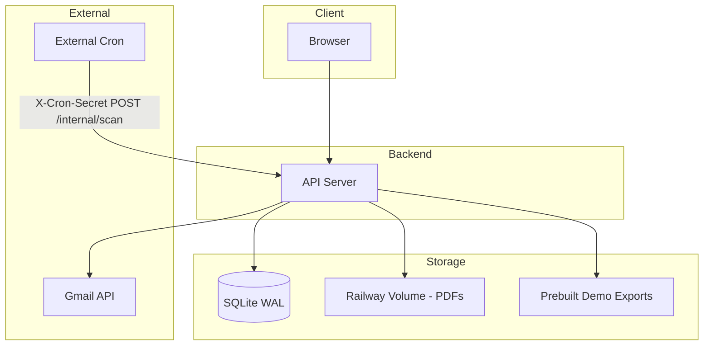

# Provable Technical Specification

## Overview

Provable automatically collects receipt attachments from a Gmail inbox and organizes them by month and vendor. The system operates in two modes: demo mode (Gmail-independent, instant) and real user mode (Gmail OAuth in Testing mode, 5 test users). Background scanning is triggered by an external cron service.

**Core product promise:** Provable automatically collects receipt attachments from your inbox and organizes them by month and vendor.

## Goals

- Extract receipt PDF attachments from Gmail and store them by month and vendor
- Provide instant, Gmail-independent demo mode for hackathon demos
- Support real users via Gmail OAuth with encrypted token storage
- Export receipts by month as ZIP files (demo prebuilt, real user generated)
- Use conservative receipt detection with precision over recall

## Non-Goals

- Supporting more than 5 real users (Testing mode limit)
- Scaling beyond a single instance
- HMAC or dynamic cron authentication
- Amount parsing for all vendors (only top 3 best-effort)
- Receiving email via SMTP or other non-Gmail sources

---

## User Flows

### Demo Path

1. User visits app, clicks Demo (POST /demo)
2. App creates demo session, serves pre-seeded receipts from SQLite and pre-seeded PDFs from /app/storage/demo/
3. Demo endpoints never call Gmail API; data served from seeded DB and disk
4. POST /demo/reset clears session only; does not delete seeded demo receipts or demo exports at /app/storage/demo_exports/

### Sample Export Backup

1. User in demo mode selects a month
2. App serves prebuilt ZIP from disk: `/app/storage/demo_exports/{month}.zip`
3. No generation at request time

### Real Gmail Connect

1. User selects Connect Gmail
2. OAuth flow redirects to Google, returns with code
3. Backend exchanges code for tokens, encrypts refresh token with Fernet, stores in gmail_accounts
4. Initial scan triggered (or user triggers manually)
5. Cron calls `/internal/scan` periodically to refresh

---

## Architecture



- **Frontend:** Serves UI, calls public API endpoints, uses session cookies for auth
- **Backend:** Handles OAuth, scan logic, export generation, internal cron endpoint
- **Storage:** SQLite for metadata, Railway volume for PDFs, prebuilt demo ZIPs on disk
- **Cron:** External service hits `/internal/scan` with `X-Cron-Secret` header

---

## Endpoint Contract

### Public Endpoints

| Method | Path | Auth | Description |
|--------|------|------|-------------|
| GET | / | None | Landing page, mode selection |
| POST | /demo | None | Create demo session, set cookie |
| POST | /demo/reset | Session (demo) | Clear session only; never deletes demo data |
| GET | /auth/login | None | Start OAuth redirect |
| GET | /auth/callback | None | OAuth callback with state validation |
| POST | /auth/disconnect | Session | Revoke best-effort, delete real user data, clear session |
| GET | /receipts | Session | List receipts for current session user |
| GET | /export/{month} | Session | Download export for YYYY-MM |
| GET | /health | None | Health check |

### Internal Endpoints

| Method | Path | Auth | Description |
|--------|------|------|-------------|
| POST | /internal/scan | X-Cron-Secret | Trigger background scan; non-demo accounts with status connected_active only; cap 50 per run |

### Request and Response Shapes

**GET /receipts**

- Response: `{ "months": ["2024-01", "2024-02"], "byMonth": { "2024-01": [{ "id": 123, "vendor": "Acme", "receipt_date": "2024-01-15", "amount_cents": 1299, "storage_path": "/app/storage/users/1/2024-01/acme/receipt-123.pdf", "confidence_score": 5, "high_confidence": true, "source": "gmail_scan" }] } }`

**GET /export/{month}**

- Path param: `month` must match `^\d{4}-(0[1-9]|1[0-2])$` (YYYY-MM); parsed with %Y-%m
- Response: ZIP binary, or 404 if no receipts for month

**POST /internal/scan**

- Headers: `X-Cron-Secret: <static-secret>`
- Response: `200` with body `{ "scanned": N }`, `401` if secret invalid, or `429` if called within 5 minutes of the prior run (scan_locks gate)

### Auth Mechanism

- **Demo:** Session cookie marks user as demo (users.is_demo = 1); no OAuth; demo endpoints never call Gmail API; demo data served from seeded DB and disk
- **Real:** Session cookie after OAuth; refresh token stored encrypted in gmail_accounts
- **Internal:** `X-Cron-Secret` header must match env var; no cookies

### Cookies

- Session cookie: HttpOnly, SameSite=Lax, Secure in production
- No long-lived auth cookies; session tied to server-side store
- Sessions stored in `sessions`; cookie carries `session_id`
- Demo session TTL: 30 minutes
- Real session TTL: 24 hours
- `sessions.expires_at` enforced server-side on every request

---

## Data Model

### Tables

**users**

```sql
users(
  id INTEGER PRIMARY KEY,
  email TEXT UNIQUE NOT NULL,
  is_demo BOOLEAN DEFAULT 0,
  created_at TIMESTAMP DEFAULT CURRENT_TIMESTAMP
)
```

**gmail_accounts**

```sql
gmail_accounts(
  id INTEGER PRIMARY KEY,
  user_id INTEGER NOT NULL REFERENCES users(id),
  google_user_id TEXT UNIQUE,
  email TEXT NOT NULL,
  refresh_token_encrypted TEXT,
  last_scan_at TIMESTAMP,
  status TEXT DEFAULT 'connected_active',
  created_at TIMESTAMP DEFAULT CURRENT_TIMESTAMP
)
```

**receipts**

```sql
receipts(
  id INTEGER PRIMARY KEY,
  user_id INTEGER NOT NULL REFERENCES users(id),
  gmail_account_id INTEGER REFERENCES gmail_accounts(id),
  gmail_message_id TEXT,
  gmail_attachment_id TEXT,
  file_sha256 TEXT NOT NULL,
  vendor TEXT,
  receipt_date DATE,
  amount_cents INTEGER,
  storage_path TEXT NOT NULL,
  confidence_score INTEGER NOT NULL,
  high_confidence BOOLEAN DEFAULT 1,
  source TEXT NOT NULL,  -- 'demo_seed' or 'gmail_scan'
  created_at TIMESTAMP DEFAULT CURRENT_TIMESTAMP,
  UNIQUE(user_id, file_sha256),
  UNIQUE(gmail_account_id, gmail_message_id, gmail_attachment_id)
)
```

This UNIQUE constraint is for real Gmail rows only. Demo rows have gmail_account_id NULL and are de-duplicated by user_id and file_sha256 plus deterministic seeded ids.

**sessions**

```sql
sessions(
  id INTEGER PRIMARY KEY,
  session_id TEXT UNIQUE NOT NULL,
  user_id INTEGER NOT NULL REFERENCES users(id),
  created_at TIMESTAMP DEFAULT CURRENT_TIMESTAMP,
  expires_at TIMESTAMP
)
```

**scan_locks**

```sql
scan_locks(
  id INTEGER PRIMARY KEY CHECK (id = 1),
  last_run TIMESTAMP NOT NULL
)
```

**settings**

```sql
settings(
  key TEXT PRIMARY KEY,
  value TEXT NOT NULL
)
```

### Indexes

- `idx_receipts_user_date` on `receipts(user_id, receipt_date)`
- `idx_receipts_user_vendor` on `receipts(user_id, vendor)`

---

## Receipt Detection and Scoring

Explicit scoring rules:

| Signal | Points |
|--------|--------|
| Sender domain in KNOWN_VENDORS | +3 |
| Filename contains 'invoice' or 'receipt' | +2 |
| Subject contains 'invoice' or 'receipt' | +2 |
| Negative subject terms in ['statement','report','newsletter','terms','policy'] | -2 |
| Attachment not PDF or image | -2 |

**Classification:**

- score >= 4: save `high_confidence = true`, show in main UI
- score == 3: save `high_confidence = false`, show in review queue only
- score <= 2: skip (do not save)

**Date source:**

- Real users: Gmail `internalDate` as primary receipt_date (converted to date)
- Demo: seeded receipt_date values

---

## Deduplication Rules

- **Level:** File-level using SHA256 of PDF bytes
- **Scope:** Uniqueness per user; same file can exist for different users
- **Constraint:** `UNIQUE(user_id, file_sha256)` in receipts table
- **Gmail-level:** `UNIQUE(gmail_account_id, gmail_message_id, gmail_attachment_id)` for scan deduplication
- **On duplicate:** Skip insert; treat as already processed

---

## Incremental Scanning Strategy

- Use Gmail API `list` with `q` filter for date range
- Query: `after:YYYY/MM/DD before:YYYY/MM/DD` (or equivalent)
- **Overlap window:** Extend range by N days on each side to catch edge cases
- Store `last_scan_at` per account in `gmail_accounts`; next scan starts from last_scan_at - overlap
- Scan only non-demo accounts with `status = 'connected_active'`
- Cap scan to 50 accounts per run
- `scan_locks(id=1,last_run)` enforces a 5 minute minimum interval and prevents overlapping runs by rejecting calls within that window; single instance assumed; no distributed locking
- Short transactions; update scan_locks.last_run when the run completes

---

## Export Behavior

### Demo Mode

- Demo export path: `/app/storage/demo_exports/{month}.zip` (exact path)
- Demo receipts path: `/app/storage/demo/`
- `/export/{month}` serves prebuilt file directly if exists; no generation
- Demo reset must not delete these files

### Real User Mode

- ZIP generated on demand
- **Limits:** max_files = 500, max_size_mb = 100
- Validate month with regex `^\d{4}-(0[1-9]|1[0-2])$`. If it fails, reject. If it passes, parse with %Y-%m. Construct export filename from validated month only. No user-controlled path segments are used. Defense in depth: reject inputs containing `..`, `/`, or `\`.

---

## Security Model

| Concern | Mechanism |
|---------|-----------|
| OAuth state | Validate state cookie/session on callback; reject mismatches |
| Token storage | Fernet encrypt refresh token; store in gmail_accounts.refresh_token_encrypted |
| Cookies | HttpOnly, SameSite=Lax, Secure in prod |
| Cron endpoint | Static X-Cron-Secret header only; 401 if missing or wrong; no dynamic HMAC |
| Month validation | Validate month with regex `^\d{4}-(0[1-9]|1[0-2])$`. If it fails, reject. If it passes, parse with %Y-%m. Construct export filename from validated month only. No user-controlled path segments are used. Defense in depth: reject inputs containing `..`, `/`, or `\`. |
| Disconnect | Revoke token best-effort; delete user files and DB rows |

---

## Acceptance Criteria

### Week 1

- [ ] SQLite schema created with WAL mode
- [ ] Demo mode serves seeded receipts and PDFs; zero Gmail calls
- [ ] Demo export serves prebuilt ZIPs
- [ ] OAuth flow completes; tokens encrypted and stored
- [ ] Basic receipt listing by month and vendor

### Week 2

- [ ] POST /internal/scan protected by X-Cron-Secret
- [ ] Scan uses scan_locks(id=1,last_run) to enforce a 5 minute minimum interval and prevent overlapping runs by rejecting calls within that window (single instance; no distributed locking)
- [ ] Scan only non-demo accounts with status connected_active; cap 50 accounts per run
- [ ] Incremental scan with date filter and overlap window
- [ ] Receipt scoring implemented (explicit rules)
- [ ] SHA256 deduplication per user

### Week 3

- [ ] Real user export with max_files=500, max_size_mb=100
- [ ] POST /auth/disconnect revokes token and deletes real user data
- [ ] POST /demo/reset clears session only; demo receipts and demo exports at /app/storage/demo_exports/ remain
- [ ] All acceptance criteria verified end-to-end

---

## Demo Script Summary

1. Deploy with seeded SQLite and seeded PDFs at /app/storage/demo/
2. Prebuild demo export ZIPs at /app/storage/demo_exports/{month}.zip
3. User visits, clicks Demo (POST /demo); sees receipts immediately from seeded DB
4. User downloads export for a month; gets prebuilt ZIP
5. User clicks Reset (POST /demo/reset); session clears; demo data and exports remain

### Failure-Safe Behavior

- If prebuilt export missing for requested month: return 404; do not fall back to Gmail
- If demo data missing: show empty state; do not call Gmail API
- Demo reset: only clear session; never run DELETE on demo receipts or export files
